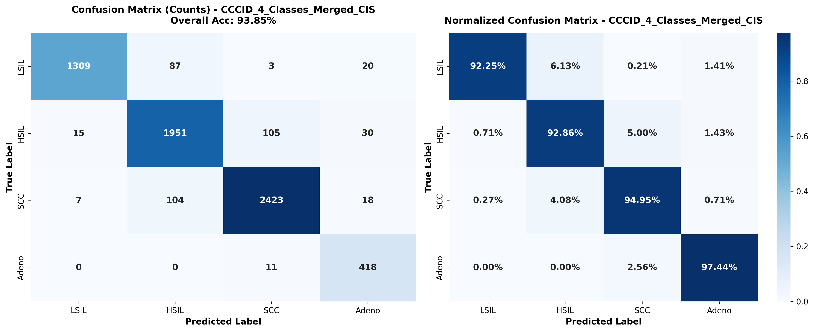
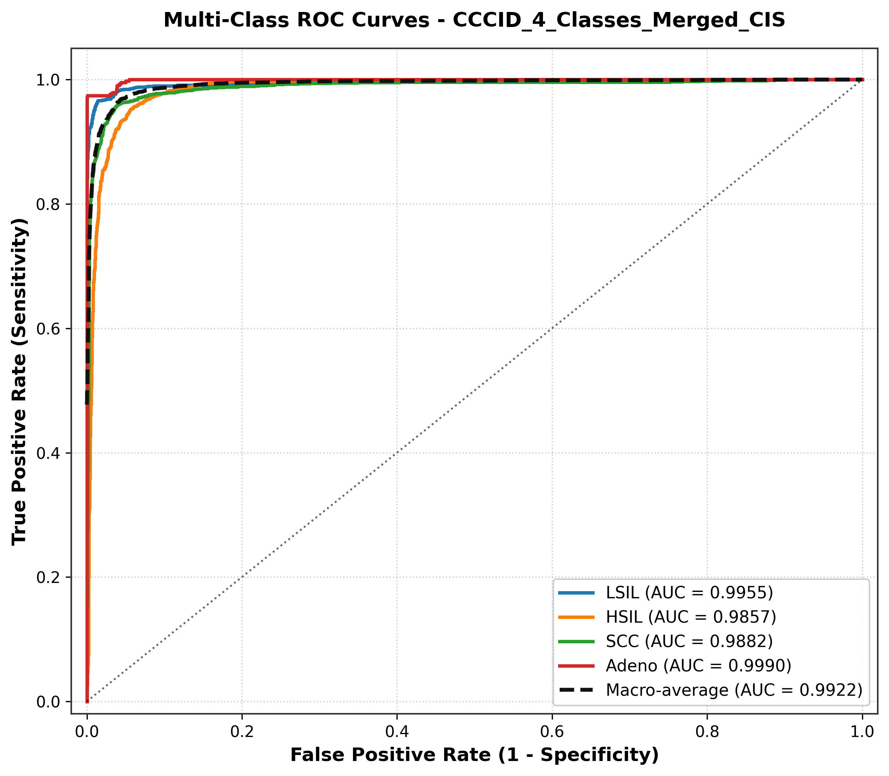
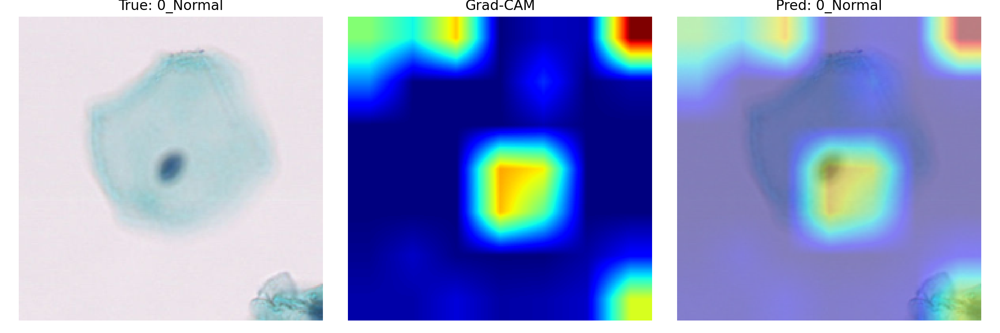

# RegNetY-16GF + Kolmogorov-Arnold Networks (KANs) for Cervical Cytology Classification

[](https://www.python.org/downloads/)
[](https://pytorch.org/)
[](https://developer.nvidia.com/cuda-toolkit)
[](https://developer.nvidia.com/cudnn)
[](https://opensource.org/licenses/MIT)
[](https://www.ieee.org/)

Official implementation of the **Hybrid RegNetY-16GF + Kolmogorov-Arnold Network (KAN)** pipeline for automated multi-class classification and explainable artificial intelligence (XAI) in **Liquid-Based Cervical Cytology (CCID)**.

---

## 📌 Proposed Architecture Pipeline

<p align="center">
  
</p>
<p align="center">
  <em>Figure 1: End-to-end architecture pipeline featuring cytological data augmentation, RegNetY-16GF backbone with Squeeze-and-Excitation (SE) bottleneck blocks, global average pooling (GAP), linear projection with LayerNorm and GELU, and a two-layer Kolmogorov–Arnold Network (KAN) classifier head.</em>
</p>

---

## 🔬 Abstract & Key Highlights

Accurate cervical cytology screening is essential for early cervical cancer detection and triage. Standard deep convolutional neural networks and vision transformers frequently suffer from intra-class cytomorphological heterogeneity, staining inconsistencies, and the risk of overfitting on cellular datasets.

To overcome these issues, we introduce a hybrid framework uniting **RegNetY-16GF** with **Kolmogorov-Arnold Networks (KANs)**:

- **RegNetY-16GF Backbone**: Optimized design space with **Squeeze-and-Excitation (SE)** residual blocks to capture multi-scale nucleocytoplasmic relationships with exceptional parameter efficiency.
- **Kolmogorov-Arnold Network (KAN) Head**: Replaces conventional fixed-weight MLPs with learnable 1D B-spline activation functions on network edges, unlocking non-linear fitting power and interpretability.
- **Leakage-Free 5-Fold Stratified Group Cross-Validation**: Tiles derived from the same source slide are strictly kept in the same fold via `StratifiedGroupKFold` across 12,749 liquid-based cytology images.
- **Anti-Overfitting Arsenal**: Integrated Random Resized Crop, Cutout (Random Erasing), ColorJitter, Label Smoothing ($0.08$), AdamW Weight Decay ($2\times 10^{-4}$), and Early Stopping.
- **Nuclear-Centric Explainable AI (Grad-CAM)**: Visualizes model attention on cellular hyperchromasia and enlarged atypical nuclei.

---

## 📊 Benchmark Results

Evaluated via **5-Fold Stratified Group Cross-Validation** on **12,749 liquid-based cytology images** across **6 Bethesda categories**:

### 1. Overall Model Comparison

| Backbone Architecture | Head | Accuracy (ACC) | Sensitivity (Recall) | Specificity (SPE) | Precision (PRE) | F1-Score | Macro AUC |
| :--- | :---: | :---: | :---: | :---: | :---: | :---: | :---: |
| **RegNetY-16GF (Proposed)** | **KAN** | **0.9405** | **0.9152** | **0.9867** | **0.9212** | **0.9178** | **0.9839** |
| DenseNet-201 | KAN | 0.9360 | 0.9151 | 0.9859 | 0.9101 | 0.9122 | **0.9867** |
| EfficientNetV2-L | KAN | 0.9395 | 0.9180 | 0.9872 | 0.9140 | 0.9154 | 0.9788 |
| ConvNeXt-Large | KAN | 0.9266 | 0.9158 | 0.9849 | 0.8874 | 0.9002 | 0.9761 |
| Swin Transformer V2-B | KAN | 0.7723 | 0.7611 | 0.9525 | 0.7433 | 0.7395 | 0.9521 |

> **Summary:** The proposed **RegNetY-16GF + KAN** achieves the highest Accuracy (**94.05%**), Precision (**92.12%**), and F1-Score (**0.9178**).

---

### 2. Per-Class Diagnostic Metrics (RegNetY-16GF + KAN)

| Class Label | Bethesda Diagnosis | Accuracy | Sensitivity (SEN) | Specificity (SPE) | Precision (PRE) | F1-Score | AUC |
| :--- | :--- | :---: | :---: | :---: | :---: | :---: | :---: |
| **0_Normal** | Negative for Intraepithelial Lesion / Malignancy (NILM) | 0.9747 | 0.9781 | 0.9715 | 0.9706 | 0.9743 | 0.9920 |
| **1_LSIL** | Low-grade Squamous Intraepithelial Lesion | 0.9862 | 0.9098 | 0.9958 | 0.9642 | 0.9362 | 0.9898 |
| **2_HSIL** | High-grade Squamous Intraepithelial Lesion | 0.9651 | 0.8239 | 0.9779 | 0.7706 | 0.7963 | 0.9585 |
| **3_CIS** | Carcinoma In Situ | 0.9809 | 0.8660 | 0.9911 | 0.8969 | 0.8812 | 0.9812 |
| **4_SCC** | Squamous Cell Carcinoma | 0.9755 | 0.9389 | 0.9847 | 0.9389 | 0.9389 | 0.9865 |
| **5_Adeno** | Endocervical / Endometrial Adenocarcinoma | 0.9987 | 0.9744 | 0.9995 | 0.9858 | 0.9801 | 0.9953 |
| **Macro Average** | *Overall Diagnostic Performance* | **0.9405** | **0.9152** | **0.9867** | **0.9212** | **0.9178** | **0.9839** |

---

## 📈 Visual Evaluation & Explainability

### Out-Of-Fold (OOF) Confusion Matrix & Multi-Class ROC Curves

<p align="center">
  
  
</p>
<p align="center">
  <em>Figure 2: Confusion Matrix (left) and Multi-Class One-vs-Rest ROC curves (right) for RegNetY-16GF + KAN.</em>
</p>

### Explainable AI (Grad-CAM) Saliency Maps

<p align="center">
  
</p>
<p align="center">
  <em>Figure 3: Grad-CAM attention maps showing precise morphological localization on hyperchromatic cell nuclei.</em>
</p>

---

## 📁 Repository Structure

```text
├── assets/                                 # 300 DPI figures, architecture diagram, and ROC curves
│   ├── proposed_regnet_kan_architecture.png
│   ├── proposed_regnet_kan_architecture.pdf
│   ├── regnet_y_16gf_confusion_matrix.png
│   ├── regnet_y_16gf_roc_curve.png
│   ├── densenet201_*, convnext_*, ...
│   └── gradcam/                            # Grad-CAM saliency heatmaps
├── results/                                # Benchmark CSV reports and run configurations
│   ├── model_comparison_table.csv          # 5-model benchmark metrics (ACC, F1, SPE, AUC)
│   ├── regnet_y_16gf_metrics.csv           # Class-wise metrics for RegNetY-16GF + KAN
│   ├── densenet201_metrics.csv, ...
│   └── run_config.json                     # Training hyperparameters
├── main.py                                 # End-to-end 5-fold Stratified Group CV & Grad-CAM pipeline
├── requirements.txt                        # Python dependencies
├── environment.yml                         # Conda environment definition
├── .gitignore                              # Git exclusion rules (prevents large weights/data commits)
├── LICENSE                                 # MIT License
└── README.md                               # Project documentation
```

---

## 🚀 Environment Setup & Quick Start

### Recommended Environment:
- **Python:** `3.12`
- **PyTorch:** `2.4.1`
- **CUDA Toolkit:** `12.4`
- **cuDNN:** `Compatible v9.x` (pre-bundled with PyTorch)

### 1. Installation

```bash
# Clone the repository
git clone https://github.com/YOUR_USERNAME/YOUR_REPOSITORY.git
cd YOUR_REPOSITORY

# Create and activate virtual environment
python -m venv venv
# On Windows:
venv\Scripts\activate
# On Linux / macOS:
source venv/bin/activate

# Install PyTorch 2.4.1 with CUDA 12.4:
pip install torch==2.4.1 torchvision==0.19.1 --index-url https://download.pytorch.org/whl/cu124

# Install required dependencies:
pip install -r requirements.txt
```

---

### 2. Dataset Organization

Organize your cervical cytology dataset in class-specific subfolders under `data/train`:

```text
data/
└── train/
    ├── 0_Normal/
    ├── 1_LSIL/
    ├── 2_HSIL/
    ├── 3_CIS/
    ├── 4_SCC/
    └── 5_Adeno/
```

> **Tile Naming for Grouping:** Files named like `SlideID_(CellIndex).png` will automatically use `SlideID` as the group identifier to prevent cross-validation data leakage across folds.

---

### 3. Training & Evaluation Pipeline

#### Single GPU / Standard Execution:
```bash
python main.py --data-dir data/train --output-dir outputs_ccid --batch-size 12 --epochs 35
```

#### Multi-GPU Setup (e.g. 2x NVIDIA A40 using torchrun / DistributedDataParallel):
```bash
torchrun --standalone --nproc_per_node=2 main.py --data-dir data/train --output-dir outputs_ccid --batch-size 12 --epochs 35 --workers 8
```

#### Fast Sweep Mode (cuDNN benchmark enabled):
```bash
python main.py --data-dir data/train --batch-size 16 --fast
```

When execution completes:
- Fold checkpoints are saved in `<output-dir>/checkpoints/`.
- Grad-CAM visualizations are saved in `<output-dir>/<model>_fold<fold>/gradcam/`.
- Confusion matrices and ROC curves are exported as 300 DPI PNGs in `<output-dir>/`.
- Consolidated benchmark comparison is saved as `model_comparison_table.csv`.

---

## 📝 Citation

If you use this project or research in your work, please cite:

```bibtex
@inproceedings{alperen2026regnetkan,
  title     = {Hybrid RegNetY-16GF and Kolmogorov-Arnold Networks for Multi-Class Cervical Cytology Classification and Nuclear Explainability},
  author    = {Alperen and Asl{\i}},
  booktitle = {Proceedings of the IEEE International Conference on Electrical, Communication and Energy Research (ICECER)},
  year      = {2026}
}
```

---

## 📜 License

Distributed under the **MIT License**. See [LICENSE](LICENSE) for more details.
