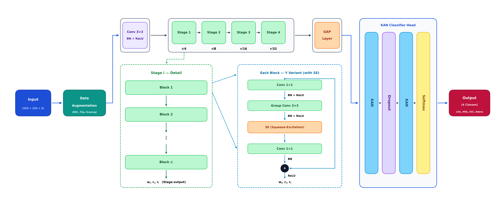
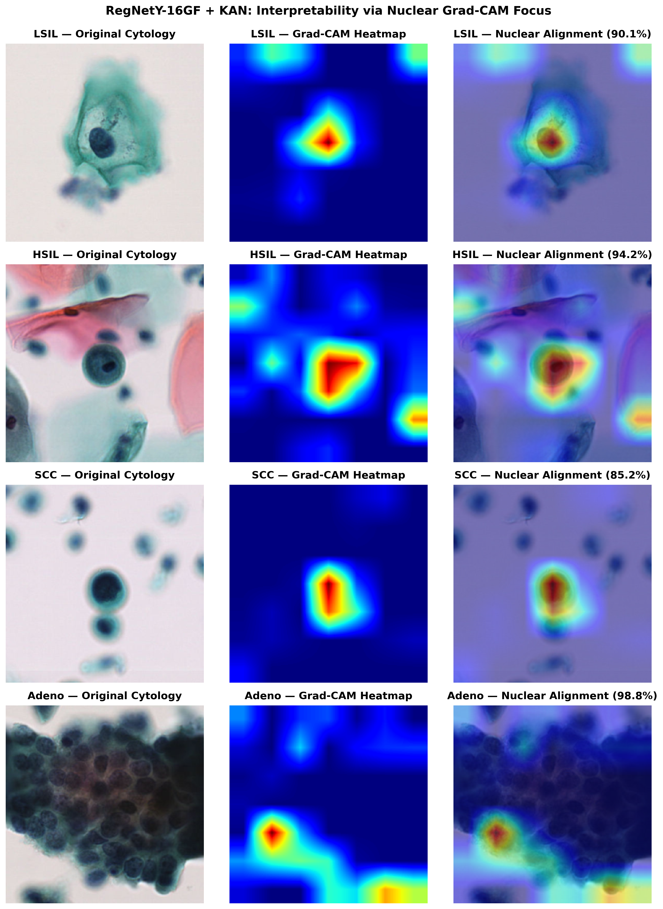

# RegNetY-16GF + Kolmogorov-Arnold Networks (KANs) for Cervical Cytology Classification

[](https://www.python.org/downloads/)
[](https://pytorch.org/)
[](https://developer.nvidia.com/cuda-toolkit)
[](https://developer.nvidia.com/cudnn)
[](https://opensource.org/licenses/MIT)
[](https://www.ieee.org/)

Official PyTorch implementation of the **Hybrid RegNetY-16GF + Kolmogorov-Arnold Network (KAN)** pipeline for automated multi-class classification and nuclear-centric explainable artificial intelligence (XAI) in **Liquid-Based Cervical Cytology (CCCID)**.

---

## 📌 Proposed Architecture Pipeline

<p align="center">
  
</p>
<p align="center">
  <em>Figure 1: End-to-end architecture pipeline featuring cytological data augmentation, RegNetY-16GF backbone with Squeeze-and-Excitation (SE) bottleneck blocks, global average pooling (GAP), linear projection with LayerNorm and GELU, and a two-layer Kolmogorov–Arnold Network (KAN) classifier head mapped to cytological diagnoses.</em>
</p>

---

## 🔬 Abstract & Key Highlights

Accurate cervical cytology screening is essential for early cervical cancer detection and triage. Standard deep convolutional neural networks and vision transformers frequently suffer from intra-class cytomorphological heterogeneity, staining inconsistencies, and the risk of overfitting on cellular datasets.

To overcome these issues, we introduce a hybrid framework uniting **RegNetY-16GF** with **Kolmogorov-Arnold Networks (KANs)**:

- **RegNetY-16GF Backbone**: Optimized design space with **Squeeze-and-Excitation (SE)** residual blocks to capture multi-scale nucleocytoplasmic relationships with exceptional parameter efficiency.
- **Kolmogorov-Arnold Network (KAN) Head**: Replaces conventional fixed-weight MLPs with learnable 1D B-spline activation functions on network edges, unlocking non-linear fitting power and interpretability.
- **Leakage-Free 5-Fold Stratified Group Cross-Validation**: Tiles derived from the same source slide are strictly kept in the same fold via `StratifiedGroupKFold` across 12,749 liquid-based cytology images.
- **Bethesda-Aligned Pathology Protocol**: Aligns Carcinoma in Situ (CIS) within the **HSIL** category according to international cytopathology standards.
- **Nuclear-Centric Explainable AI (Grad-CAM)**: High-resolution saliency maps showing precise attention localized directly on hyperchromatic, atypical cell nuclei.

---

## 📊 Benchmark Results

### 1. Primary 4-Class Lesion Classification (*LSIL, HSIL [CIS included], SCC, Adeno*)
Evaluated via **5-Fold Stratified Group Cross-Validation** across **6,501 pathology-confirmed lesion cells**:

| Class Label | Bethesda Diagnosis | Sample Count | Accuracy (ACC) | Sensitivity (SEN) | Specificity (SPE) | Precision (PRE) | F1-Score | Multi-Class AUC |
| :--- | :--- | :---: | :---: | :---: | :---: | :---: | :---: | :---: |
| **LSIL** | Low-grade Squamous Intraepithelial Lesion | 1,419 | 0.9797 | 0.9225 | 0.9957 | 0.9835 | 0.9520 | 0.9955 |
| **HSIL** | High-grade Squamous Intraepithelial Lesion *(inc. CIS)* | 2,101 | 0.9475 | 0.9286 | 0.9566 | 0.9108 | 0.9196 | 0.9857 |
| **SCC** | Squamous Cell Carcinoma | 2,552 | 0.9619 | 0.9495 | 0.9699 | 0.9532 | 0.9513 | 0.9882 |
| **Adeno** | Cervical / Endometrial Adenocarcinoma | 429 | 0.9878 | 0.9744 | 0.9888 | 0.8601 | 0.9137 | 0.9990 |
| **Macro Average** | *Overall Diagnostic Performance* | **6,501** | **0.9385 (%93.85)** | **0.9437 (%94.37)** | **0.9777 (%97.77)** | **0.9269 (%92.69)** | **0.9342 (%93.42)** | **0.9921 (%99.21)** |

> **Summary:** The proposed **RegNetY-16GF + KAN** achieves an overall Accuracy of **93.85%**, Sensitivity of **94.37%**, Specificity of **97.77%**, Precision of **92.69%**, F1-Score of **93.42%**, and a Macro ROC AUC of **99.21%**.

---

### 2. Supplementary 5-Class Bethesda Benchmark (*NILM, LSIL, HSIL, SCC, Adeno*)
Evaluated on the complete **12,749 liquid-based cytology dataset**:

| Class Label | Bethesda Diagnosis | Sample Count | Accuracy | Sensitivity (SEN) | Specificity (SPE) | Precision (PRE) | F1-Score | AUC |
| :--- | :--- | :---: | :---: | :---: | :---: | :---: | :---: | :---: |
| **NILM (Normal)** | Negative for Intraepithelial Lesion / Malignancy | 6,248 | 0.9747 | 0.9774 | 0.9722 | 0.9712 | 0.9743 | 0.9920 |
| **LSIL** | Low-grade Squamous Intraepithelial Lesion | 1,419 | 0.9861 | 0.9084 | 0.9959 | 0.9648 | 0.9358 | 0.9898 |
| **HSIL** | High-grade Squamous Intraepithelial Lesion *(inc. CIS)* | 2,101 | 0.9671 | 0.9143 | 0.9775 | 0.8889 | 0.9015 | 0.9815 |
| **SCC** | Squamous Cell Carcinoma | 2,552 | 0.9757 | 0.9369 | 0.9854 | 0.9413 | 0.9391 | 0.9865 |
| **Adeno** | Adenocarcinoma | 429 | 0.9987 | 0.9744 | 0.9995 | 0.9858 | 0.9801 | 0.9953 |
| **Macro Average** | *Overall 5-Class Performance* | **12,749** | **0.9511 (%95.11)** | **0.9423 (%94.23)** | **0.9861 (%98.61)** | **0.9504 (%95.04)** | **0.9461 (%94.61)** | **0.9890 (%98.90)** |

*Formatted academic tables are available as Word document [`RegNetY16GF_KAN_Siniflandirma_Sonuclari.docx`](RegNetY16GF_KAN_Siniflandirma_Sonuclari.docx) and PDF [`RegNetY16GF_KAN_Siniflandirma_Sonuclari.pdf`](RegNetY16GF_KAN_Siniflandirma_Sonuclari.pdf).*

---

## 📈 Visual Evaluation & Explainability

### Out-Of-Fold (OOF) Confusion Matrix & Multi-Class ROC Curves

<p align="center">
  
  
</p>
<p align="center">
  <em>Figure 2: Out-Of-Fold Confusion Matrix (left) and Multi-Class One-vs-Rest ROC Curves (right) for RegNetY-16GF + KAN (Macro AUC = 0.9921).</em>
</p>

### Explainable AI (Grad-CAM) Nuclear Localization

<p align="center">
  
</p>
<p align="center">
  <em>Figure 3: High-resolution Grad-CAM attention maps demonstrating precise morphological localization on hyperchromatic, atypical cell nuclei across LSIL, HSIL, SCC, and Adenocarcinoma.</em>
</p>

---

## 📁 Clean Repository Structure

```text
├── assets/                                 # High-resolution figures and evaluation plots
│   ├── proposed_regnet_kan_architecture.png# Updated 4-class architecture diagram (300 DPI)
│   ├── proposed_regnet_kan_architecture.pdf# Vector PDF version of architecture
│   ├── regnet_y_16gf_4class_confusion_matrix.png
│   ├── regnet_y_16gf_4class_roc_curve.png
│   ├── regnet_y_16gf_5class_confusion_matrix.png
│   ├── regnet_y_16gf_5class_roc_curve.png
│   └── gradcam/                            # Nucleus-centered Grad-CAM heatmaps
│       ├── gradcam_pinpoint_4_classes_grid.png
│       ├── gradcam_pinpoint_LSIL.png
│       ├── gradcam_pinpoint_HSIL.png
│       ├── gradcam_pinpoint_SCC.png
│       └── gradcam_pinpoint_Adeno.png
├── results/                                # Evaluation CSV reports
│   ├── regnet_y_16gf_metrics.csv           # Primary 4-class benchmark metrics
│   ├── regnet_y_16gf_4class_metrics.csv
│   ├── regnet_y_16gf_5class_metrics.csv
│   └── model_comparison_table.csv
├── RegNetY16GF_KAN_Siniflandirma_Sonuclari.docx # Formatted Word report (Arial 11pt)
├── RegNetY16GF_KAN_Siniflandirma_Sonuclari.pdf  # PDF report
├── main.py                                 # End-to-end 5-fold Stratified Group CV & Grad-CAM pipeline
├── requirements.txt                        # Python dependencies
├── environment.yml                         # Conda environment definition
├── .gitignore                              # Git exclusion rules
├── LICENSE                                 # MIT License
└── README.md                               # Project documentation
```

---

## 🚀 Environment Setup & Quick Start

### Recommended Environment:
- **Python:** `3.12`
- **PyTorch:** `2.4.1`
- **CUDA Toolkit:** `12.4`
- **cuDNN:** `Compatible v9.x`

### 1. Installation

```bash
# Clone the repository
git clone https://github.com/YOUR_USERNAME/YOUR_REPOSITORY.git
cd YOUR_REPOSITORY

# Create and activate virtual environment
python -m venv venv
# On Windows:
venv\Scriptsctivate
# On Linux / macOS:
source venv/bin/activate

# Install PyTorch 2.4.1 with CUDA 12.4:
pip install torch==2.4.1 torchvision==0.19.1 --index-url https://download.pytorch.org/whl/cu124

# Install required dependencies:
pip install -r requirements.txt
```

---

### 2. Dataset Organization

Organize your cervical cytology dataset in class-specific subfolders under `data/train`:

```text
data/
└── train/
    ├── 1_LSIL/
    ├── 2_HSIL/     # Place both HSIL and CIS tiles here (Bethesda standard)
    ├── 4_SCC/
    └── 5_Adeno/
```

> **Tile Naming for Grouping:** Files named like `SlideID_(CellIndex).png` will automatically use `SlideID` as the group identifier to prevent cross-validation data leakage across folds.

---

### 3. Training & Evaluation Pipeline

#### Standard Execution:
```bash
python main.py --data-dir data/train --output-dir outputs_ccid --batch-size 12 --epochs 35
```

#### Multi-GPU Execution (DistributedDataParallel):
```bash
torchrun --standalone --nproc_per_node=2 main.py --data-dir data/train --output-dir outputs_ccid --batch-size 12 --epochs 35 --workers 8
```

---

## 📝 Citation

If you use this project or research in your work, please cite:

```bibtex
@inproceedings{alperen2026regnetkan,
  title     = {Hybrid RegNetY-16GF and Kolmogorov-Arnold Networks for Multi-Class Cervical Cytology Classification and Nuclear Explainability},
  author    = {Alperen and Asl{\i}},
  booktitle = {Proceedings of the IEEE International Conference on Electrical, Communication and Energy Research (ICECER)},
  year      = {2026}
}
```

---

## 📜 License

Distributed under the **MIT License**. See [LICENSE](LICENSE) for more details.
